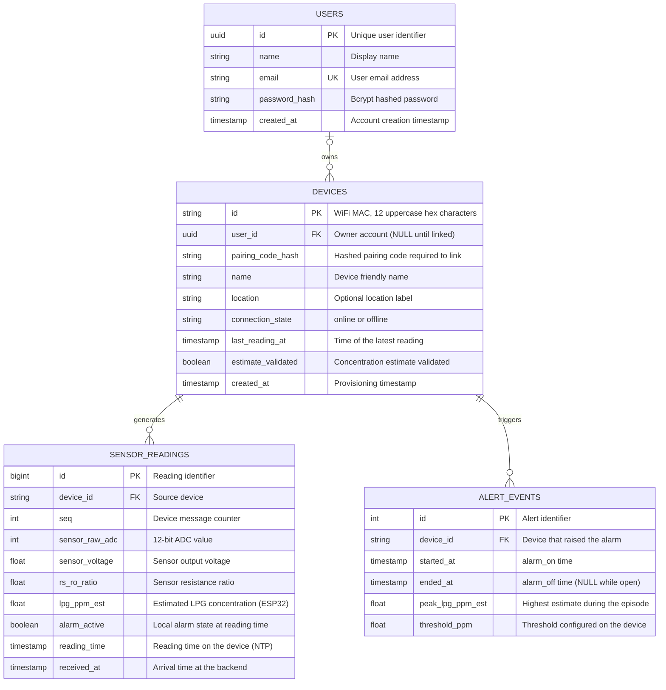

```mermaid
erDiagram
    USERS |o--o{ DEVICES : "owns"
    DEVICES ||--o{ SENSOR_READINGS : "generates"
    DEVICES ||--o{ ALERT_EVENTS : "triggers"

    USERS {
        uuid id PK "Unique user identifier"
        string name "Display name"
        string email UK "User email address"
        string password_hash "Bcrypt hashed password"
        timestamp created_at "Account creation timestamp"
    }

    DEVICES {
        string id PK "WiFi MAC, 12 uppercase hex characters"
        uuid user_id FK "Owner account (NULL until linked)"
        string pairing_code_hash "Hashed pairing code required to link"
        string name "Device friendly name"
        string location "Optional location label"
        string connection_state "online or offline"
        timestamp last_reading_at "Time of the latest reading"
        boolean estimate_validated "Concentration estimate validated"
        timestamp created_at "Provisioning timestamp"
    }

    SENSOR_READINGS {
        bigint id PK "Reading identifier"
        string device_id FK "Source device"
        int seq "Device message counter"
        int sensor_raw_adc "12-bit ADC value"
        float sensor_voltage "Sensor output voltage"
        float rs_ro_ratio "Sensor resistance ratio"
        float lpg_ppm_est "Estimated LPG concentration (ESP32)"
        boolean alarm_active "Local alarm state at reading time"
        timestamp reading_time "Reading time on the device (NTP)"
        timestamp received_at "Arrival time at the backend"
    }

    ALERT_EVENTS {
        int id PK "Alert identifier"
        string device_id FK "Device that raised the alarm"
        timestamp started_at "alarm_on time"
        timestamp ended_at "alarm_off time (NULL while open)"
        float peak_lpg_ppm_est "Highest estimate during the episode"
        float threshold_ppm "Threshold configured on the device"
    }
```
