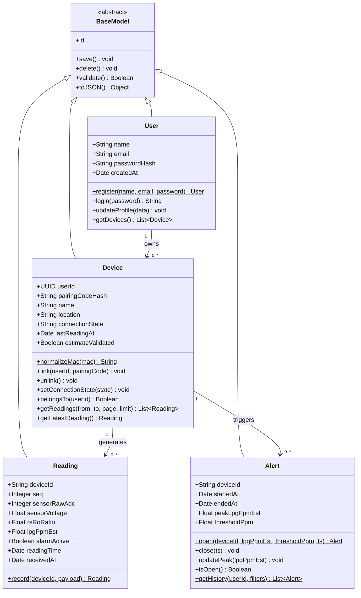
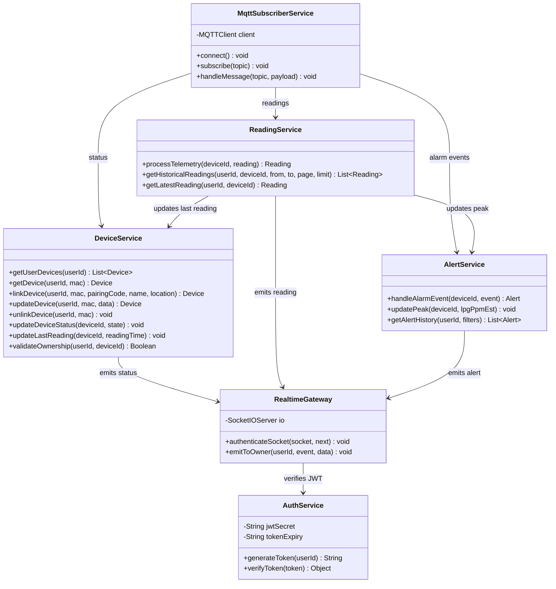

# Section 2.1: Class Diagram

The backend is designed around four domain classes that mirror the database tables in the [ER Diagram](stage-3-ER-Diagram.md). All four inherit common behavior from `BaseModel`. A thin service layer coordinates them and contains every method called in the [Sequence Diagrams](stage-3-Sequence-Diagrams.md). Field names, topics, and endpoints follow the [API Specifications](stage-3-Document-External-and-Internal-APIs.md).

---

## 1. Domain Model

### Class Descriptions

| Class | Table | Responsibility | User stories |
| --- | --- | --- | --- |
| `BaseModel` | — | Abstract parent. Holds the primary key `id` and the shared persistence methods: `save()` inserts or updates the row, `delete()` removes it, `validate()` checks required fields and types before saving, and `toJSON()` returns the object for the API. | — |
| `User` | `users` | A registered account. `register()` hashes the password with bcrypt and saves the user (`409` if the email exists); `login()` compares the password and returns a JWT; `toJSON()` returns only `id`, `name`, and `email`. `id` is a UUID. | US-01, US-05 |
| `Device` | `devices` | One ESP32 unit. `id` is its WiFi MAC in 12 uppercase hex characters; `normalizeMac()` removes `:` or `-` and converts to uppercase. `link()` attaches the device to an account only if the pairing code matches and it is not already linked. `setConnectionState()` applies `online` / `offline` from the status topic. `belongsTo()` enforces data isolation. | US-05, US-06, US-08 |
| `Reading` | `sensor_readings` | One sensor observation. `lpgPpmEst` and `alarmActive` come from the ESP32 and are stored as received. `record()` ignores a repeated message with the same `(deviceId, readingTime)`. | US-02, US-07 |
| `Alert` | `alert_events` | One leak episode. `open()` runs on `alarm_on`, `close()` on `alarm_off`, and `updatePeak()` keeps the highest estimate while the alert is open. A device has at most one open alert. | US-04, US-09 |

### Relationships

| Relationship | Type | Meaning |
| --- | --- | --- |
| `BaseModel` ◁— `User`, `Device`, `Reading`, `Alert` | Inheritance | Every domain class reuses `save()`, `delete()`, `validate()`, and `toJSON()`. |
| `User` 1 → 0..* `Device` | Association | A user owns zero or more devices; each device belongs to at most one user (`US-14` sharing is out of scope). |
| `Device` 1 → 0..* `Reading` | Association | A device produces a continuous series of readings. |
| `Device` 1 → 0..* `Alert` | Association | A device can trigger many alerts over time, one per leak episode. |

---

## 2. Service Layer

Services coordinate the domain classes for each use case. Their method names match the Sequence Diagrams exactly.

### Service Descriptions

| Service | Uses | Responsibility | Sequence |
| --- | --- | --- | --- |
| `MqttSubscriberService` | `ReadingService`, `AlertService`, `DeviceService` | Subscribes to `aqms/devices/+/#`, rejects messages whose `device_id` does not match `{mac}` or belongs to an unregistered device, and routes by topic: `readings`, `alarms`, `status`. | 1, 2 |
| `DeviceService` | `Device` | Linking with a pairing code, ownership checks, and connection state. `updateDeviceStatus()` handles both `online` and the broker's Last Will `offline`. | 1, 2, 3 |
| `ReadingService` | `Reading` | Stores each reading, updates the device's `last_reading_at`, and returns paginated history only after `validateOwnership()` succeeds. | 1, 3 |
| `AlertService` | `Alert` | `handleAlarmEvent()` opens an alert on `alarm_on` and closes it on `alarm_off`; the alarm decision itself is made on the device. | 2 |
| `AuthService` | `User` | Issues and verifies the JWT that carries the user's `id`. | 3 |
| `RealtimeGateway` | `AuthService` | Authenticates Socket.IO connections and sends `reading:new`, `alert:new`, and `device:status` only to the owner's room `user:{userId}`. | 1, 2 |

### REST Controllers

Each controller reads the HTTP request, calls one service, and returns the status code and JSON. An authentication middleware verifies the JWT on every route except register, login, and health, and passes `userId` to the controller. A device that belongs to another account returns `404`, so the API does not reveal that it exists.

| Controller | Calls | Endpoints (`/api/v1`) |
| --- | --- | --- |
| `AuthController` | `User`, `AuthService` | `POST /auth/register`, `POST /auth/login`, `GET /auth/me` |
| `DeviceController` | `DeviceService` | `GET /devices`, `POST /devices`, `GET /devices/:mac`, `PATCH /devices/:mac`, `DELETE /devices/:mac` |
| `ReadingController` | `ReadingService` | `GET /devices/:mac/readings`, `GET /devices/:mac/readings/latest` |
| `AlertController` | `AlertService` | `GET /alerts`, `GET /devices/:mac/alerts` |
| `HealthController` | — | `GET /health` |
