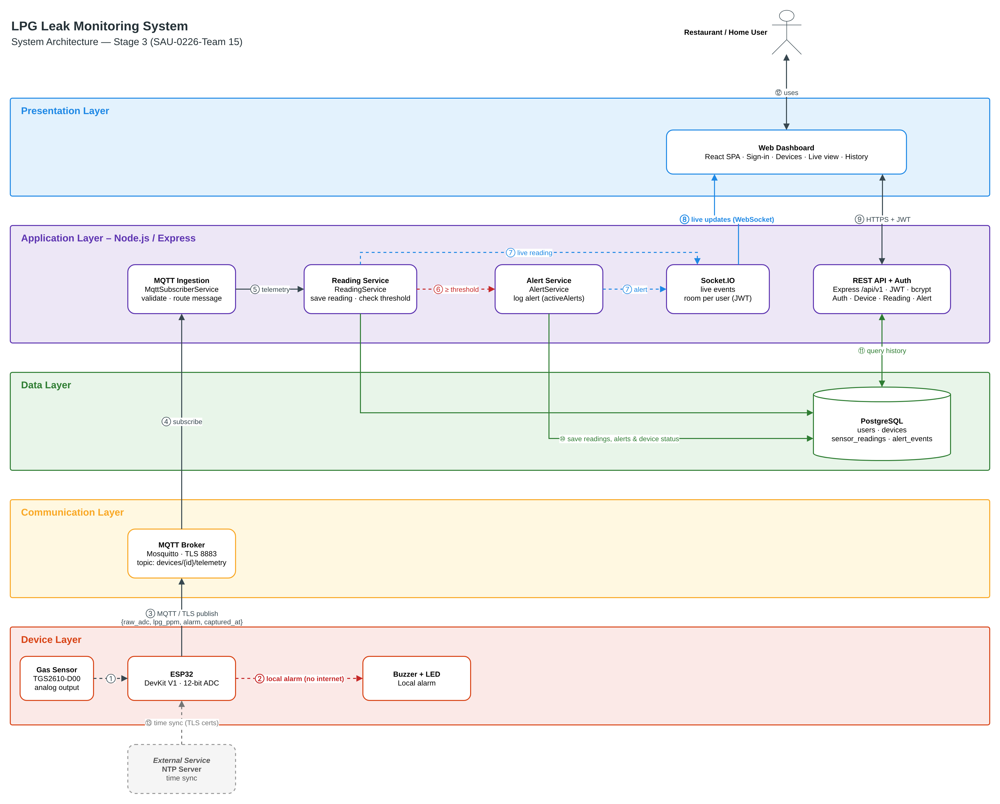

# Section 1: High-Level System Architecture

Editable source: [architecture.drawio](architecture.drawio)

| # | Flow | Description |
| --- | --- | --- |
| ① | Sensor → ESP32 | Analog voltage read by the 12-bit ADC |
| ② | ESP32 → Buzzer + LED | Local alarm when `lpg_ppm_est` ≥ `threshold_ppm`; decided on the device, works without internet |
| ③ | ESP32 → MQTT Broker | Publish to `aqms/devices/{mac}/readings`, `/alarms`, and `/status` over MQTT/TLS (QoS 1); each device has its own broker credentials. The broker publishes the device's Last Will (`offline`) if it drops |
| ④ | Broker → MQTT Ingestion | `MqttSubscriberService` subscribes to `aqms/devices/+/#`, validates each message, and routes it by topic |
| ⑤ | Ingestion → Reading Service | Readings are validated and stored |
| ⑥ | Ingestion → Alert Service | `alarm_on` opens an alert episode, `alarm_off` closes it |
| ⑦ | Services → Socket.IO | Live readings and alerts |
| ⑧ | Socket.IO → Dashboard | Live updates to the owner's room only |
| ⑨ | Dashboard ↔ REST API | HTTPS + JWT (`/api/v1`) |
| ⑩ | Services → PostgreSQL | Save readings, alerts, and device status |
| ⑪ | REST API ↔ PostgreSQL | Historical queries |
| ⑫ | User ↔ Dashboard | Web browser |
| ⑬ | NTP → ESP32 | Time sync for TLS certificates and the `reading_time` of each reading |