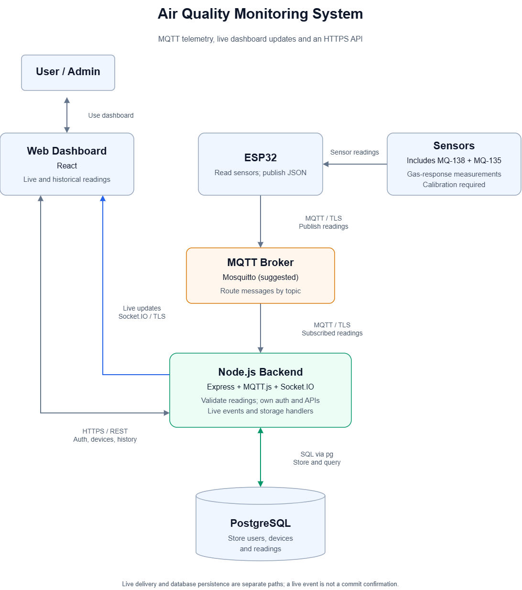

# Stage 1 Report: Team Formation and Idea Development

**Task: Idea Development Documentation**  
**Team:** SAU-0226-Team 15  
**Project:** Air Quality Monitoring System  
**Repository:** `air-quality-monitoring-system`  
**Status:** Documentation and planning only; implementation has not started.

## 1. Team Formation and Collaboration

The team consists of three members with assigned responsibilities across backend development, frontend development, hardware, and project management.

| Team Member | Role | Planned Responsibilities |
| --- | --- | --- |
| Abdulrahman Asiri | Backend Developer | Design the database and API; implement authentication, MQTT ingestion, validation, persistence, and live events. |
| Khalid Aloraini | Frontend Developer | Build the dashboard, live and historical views, authentication screens, and web alert interface. |
| Abdulmalik Alaqeel | Hardware Developer & Project Manager | Integrate the ESP32, sensors, buzzer, and LED; develop firmware; coordinate tasks, progress, and integration. |

This distribution gives each major system area a primary owner and matches the team's interest in combining software with physical hardware. Integration and documentation will require contributions from all members.

**Communication:** The team uses Discord and has created a WhatsApp group for coordination.

**Planned collaboration approach:** Members will coordinate through these channels, share progress and blockers, and agree on the data exchanged between hardware, backend, and frontend. The project manager will organize follow-up and keep scope decisions visible to the team. Specific meeting dates or voting procedures are not prescribed in this report.

## 2. Ideas Explored

The team considered three ideas and compared their feasibility, fit with available skills, potential usefulness, and differentiation. The descriptions and rejection reasons below reflect the team's account of its discussions.

### Idea A: AI-Supported Courtroom Advocacy Training

**Description:** A platform for law students to practise advocacy before courts through AI-supported simulations. It would provide an interactive environment for applying legal knowledge and developing argument and presentation skills.

**Strengths:**

- Addresses a focused educational need through practical training.
- Connects a team member's legal background with software development.
- Offers a distinctive portfolio experience with opportunities for simulated cases and feedback.

**Weaknesses and constraints:**

- Only one team member specializes in law, concentrating domain work and review on that member.
- The available project period is insufficient for the intended scope.
- The team would need additional AI skills.
- AI services and implementation could introduce significant costs.

**Decision:** Rejected for this team portfolio project because the legal dependency, learning requirements, time constraints, and potential cost make the intended scope difficult to deliver within the project window.

### Idea B: Restaurant Ordering Before Arrival

**Description:** Customers place an order before reaching a restaurant so that it is ready when they arrive. The application would connect customer ordering with preparation status at the restaurant.

**Strengths:**

- Offers a clear convenience benefit by reducing waiting on arrival.
- Provides a straightforward full-stack workflow around users, menus, orders, and status updates.
- Is easy to explain and demonstrate.

**Weaknesses and constraints:**

- The team considered the idea repetitive and already represented in the market.
- Existing alternatives could replace the proposed service easily.
- The concept offered limited differentiation for the team's portfolio.

**Decision:** Rejected because the team judged that existing alternatives reduce the value of building another similar service. This records the team's assessment of the idea.

### Idea C: Air Quality Monitoring System

**Description:** An ESP32-based device collects sensor observations, provides local alerts through a buzzer and LED, and publishes data to a custom backend. A web dashboard presents live readings, notifications, and historical records.

**Strengths:**

- Combines hardware, backend development, database design, and frontend development.
- Supports a clear distribution of work across the three team members.
- Provides a visible end-to-end demonstration from physical observation to dashboard and stored history.
- Can begin with a bounded prototype and expand after the core flow is working.

**Weaknesses and constraints:**

- Sensor suitability, calibration, and interpretation require validation.
- Hardware availability and integration may affect progress.
- Device messages, database records, and dashboard events must use consistent formats.
- Gas-specific claims require evidence for the actual selected hardware.

**Decision:** Selected as the team's portfolio project.

## 3. Simple Idea Evaluation

The following **proposed comparison** summarizes the team's stated reasoning. Each criterion is scored from **1 (weak fit) to 5 (strong fit)**. The four scores are added directly for a total out of **20**, with no weighting.

| Idea | Feasibility | Team Fit | User Benefit | Differentiation | Total / 20 |
| --- | ---: | ---: | ---: | ---: | ---: |
| Air Quality Monitoring System | 4 | 4 | 4 | 3 | **15** |
| AI-Supported Courtroom Training | 2 | 2 | 4 | 4 | **12** |
| Restaurant Ordering Before Arrival | 4 | 4 | 3 | 1 | **12** |

**Criteria:**

- **Feasibility:** Can the intended MVP be delivered within the available time and resources?
- **Team Fit:** Does the work fit the team's roles and available skills?
- **User Benefit:** Does the idea address a useful and understandable user problem?
- **Differentiation:** Does the proposed experience offer enough distinction for this portfolio?

Air quality monitoring ranks first because it combines a practical scope with a clear division of hardware and software work. Its differentiation score acknowledges that monitoring systems already exist; the portfolio value lies in the team's implementation and integration. The other ideas tie numerically but were rejected for different reasons: delivery constraints for courtroom training and limited differentiation for restaurant ordering.

These scores are a suggested summary of the qualitative reasoning, not measurements of market demand or a record of a formal team vote.

## 4. Selected MVP Concept

### Problem

The project addresses the difficulty of observing gas-related sensor changes continuously and reviewing them over time. For the initial workshop use case, the goal is to bring sensor readings, local indicators, web notifications, and historical records into one accessible system that can support inspection work.

The team's motivating use case includes possible refrigerant leakage during automotive air-conditioning inspection. Establishing detection of a particular refrigerant, including R-134a, remains a sensor-selection and validation requirement.

### Target Audience

The first target audience is **owners and managers of independent automotive air-conditioning repair workshops in Riyadh**. These users are the intended early audience for a prototype that supports inspection with visible sensor observations and recorded history.

Private vehicle owners and indoor environments such as homes, offices, clinics, and childcare facilities are possible later audiences. They do not change the first target market documented here.

### Planned Solution and Core Features

| Feature | Expected Behavior |
| --- | --- |
| Sensor monitoring | Collect identifiable observations from sensors connected to the ESP32. |
| Local alerts | Activate a buzzer and LED when a configured prototype threshold is exceeded, without waiting for a cloud response. |
| Live dashboard | Show incoming readings, timestamps, sensor-response indicators, and connection state. |
| Web notifications | Display alert events in the connected web dashboard. |
| Historical records | Store readings and alert events for later review by device, sensor, and time range. |
| Authentication and access control | Allow authorized users to access their permitted devices and data. |
| Device management | Register and manage devices and their attached sensors. |

Thresholds and display labels will reflect the validated sensor behavior. The initial design uses MQ-135 and MQ-138; refrigerant identity and concentration will require suitable validated hardware and calibration.

### User Journey

1. A workshop user signs in and opens the dashboard for a registered device.
2. The ESP32 gathers sensor observations and publishes them through MQTT.
3. The user views incoming readings and device connection state on the dashboard.
4. If a configured threshold condition is reached, the device activates its local buzzer and LED; the connected dashboard displays the reported alert.
5. The user reviews stored observations and alert history to see how readings changed over time.

### Technical Direction

The planned system uses ESP32 hardware, MQTT telemetry, a Node.js/Express backend, PostgreSQL storage, and a React dashboard with Socket.IO updates. The team will implement its own database design, APIs, validation, authentication, authorization, and frontend.

*The diagram shows the core data flow. The planned buzzer and LED are local ESP32 outputs described in the feature list.*

Redis buffering is an optional design extension to evaluate as storage and recovery requirements become clearer. Further technical detail is available in the [project README](../README.md).

### Reasons for Selection and Potential Impact

The selected project gives all three members substantial work in their assigned areas. It combines physical hardware with a complete software system and provides a clear demonstration of how sensor data moves through an API server, database, and interface.

The intended benefit is easier access to current observations, threshold notifications, and historical trends during inspection. The prototype will provide a basis for evaluating practical usefulness with the intended workshop audience; diagnostic accuracy and commercial outcomes have not yet been tested.

## 5. Challenges and Opportunities

| Challenge | Planned Response |
| --- | --- |
| Sensor interpretation and calibration | Verify sensor specifications and use measurement labels appropriate to the actual hardware. |
| Hardware availability and integration | Agree on the observation format early and use a test publisher while hardware integration is underway. |
| Coordination between components | Document payloads, device identifiers, timestamps, API responses, and live events. |
| Duplicate messages and interrupted connections | Design duplicate handling, connection indicators, historical refresh, and recovery tests. |
| Time and scope | Prioritize the core sensor-to-dashboard flow and review additional features against the project timeline. |

The project offers opportunities to learn hardware/software integration, message-driven data collection, secure APIs, database design, and live interfaces. Once the prototype is evaluated, the team can consider additional sensors or deployment settings.

## 6. Current Status and Next Stages

The team has selected the concept, assigned roles, established communication channels, and prepared the idea and architecture documentation. **Software development, hardware assembly, and testing have not started.**

The work follows the supplied Holberton project overview:

| Stage | Deliverable / Focus | Duration |
| --- | --- | --- |
| 1 | Team Formation and Idea Development | 2 weeks |
| 2 | Project Charter | 2 weeks |
| 3 | Technical Documentation | 2 weeks |
| 4 | MVP Development | 4 weeks |
| 5 | Project Closure | 2 weeks |

This report is the documentation deliverable for **Stage 1**. It records the team, explored ideas, evaluation, selection rationale, intended users, core features, risks, and expected outcome. The next stage will formalize the project charter, including scope, stakeholders, and risks.
