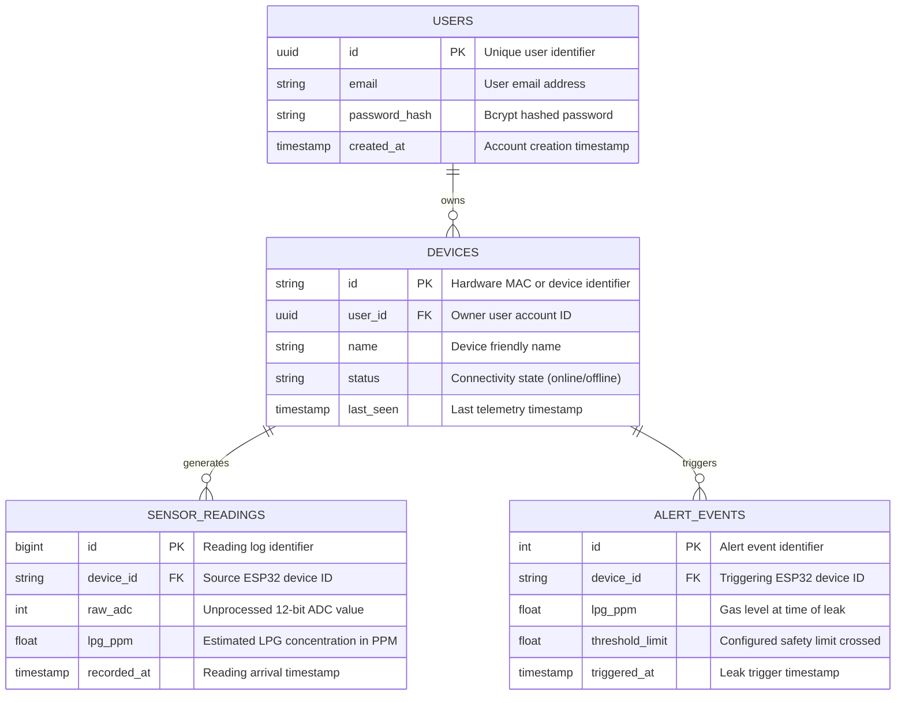

```mermaid
erDiagram
    USERS ||--o{ DEVICES : "owns"
    DEVICES ||--o{ SENSOR_READINGS : "generates"
    DEVICES ||--o{ ALERT_EVENTS : "triggers"

    USERS {
        uuid id PK "Unique user identifier"
        string email "User email address"
        string password_hash "Bcrypt hashed password"
        timestamp created_at "Account creation timestamp"
    }

    DEVICES {
        string id PK "Hardware MAC or device identifier"
        uuid user_id FK "Owner user account ID"
        string name "Device friendly name"
        string status "Connectivity state (online/offline)"
        timestamp last_seen "Last telemetry timestamp"
    }

    SENSOR_READINGS {
        bigint id PK "Reading log identifier"
        string device_id FK "Source ESP32 device ID"
        int raw_adc "Unprocessed 12-bit ADC value"
        float lpg_ppm "Estimated LPG concentration in PPM"
        timestamp recorded_at "Reading arrival timestamp"
    }

    ALERT_EVENTS {
        int id PK "Alert event identifier"
        string device_id FK "Triggering ESP32 device ID"
        float lpg_ppm "Gas level at time of leak"
        float threshold_limit "Configured safety limit crossed"
        timestamp triggered_at "Leak trigger timestamp"
    }
```
