## 1. Mermaid UML Class Diagram

```mermaid
classDiagram
    direction TB

    %% Controllers Layer
    class AuthController {
        -AuthService authService
        +register(req: Request, res: Response) Promise~void~
        +login(req: Request, res: Response) Promise~void~
        +getProfile(req: Request, res: Response) Promise~void~
    }

    class DeviceController {
        -DeviceService deviceService
        +getDevices(req: Request, res: Response) Promise~void~
        +registerDevice(req: Request, res: Response) Promise~void~
        +getDeviceDetails(req: Request, res: Response) Promise~void~
    }

    class ReadingController {
        -ReadingService readingService
        +getHistoricalReadings(req: Request, res: Response) Promise~void~
        +getLatestReading(req: Request, res: Response) Promise~void~
    }

    class AlertController {
        -AlertService alertService
        +getAlertHistory(req: Request, res: Response) Promise~void~
    }

    %% Services Layer
    class AuthService {
        -String jwtSecret
        -String tokenExpiry
        -UserRepository userRepository
        +generateToken(userId: String) String
        +verifyToken(token: String) Object
        +hashPassword(password: String) Promise~String~
        +comparePassword(raw: String, hashed: String) Promise~Boolean~
    }

    class DeviceService {
        -DeviceRepository deviceRepository
        +getUserDevices(userId: String) Promise~List~Device~~
        +registerDevice(userId: String, deviceData: Object) Promise~Device~
        +updateDeviceStatus(deviceId: String, status: String) Promise~void~
        +validateOwnership(userId: String, deviceId: String) Promise~Boolean~
    }

    class ReadingService {
        -Float alarmThresholdPPM
        -ReadingRepository readingRepository
        -AlertService alertService
        -DeviceService deviceService
        +processTelemetry(deviceId: String, rawAdc: Integer, lpgPpm: Float) Promise~Reading~
        +calculateEstimatedPpm(rawAdc: Integer) Float
        +getHistoricalReadings(deviceId: String, dateRange: Object) Promise~List~Reading~~
    }

    class AlertService {
        -AlertRepository alertRepository
        -Map activeAlerts
        +triggerAlert(deviceId: String, lpgPpm: Float, threshold: Float) Promise~Alert~
        +getAlertHistory(userId: String, filters: Object) Promise~List~Alert~~
    }

    class MqttSubscriberService {
        -MQTTClient client
        -ReadingService readingService
        -DeviceService deviceService
        +connect() void
        +subscribe(topic: String) void
        +handleMessage(topic: String, payload: Buffer) void
    }

    %% Relationships
    AuthController --> AuthService : uses
    DeviceController --> DeviceService : uses
    ReadingController --> ReadingService : uses
    AlertController --> AlertService : uses

    MqttSubscriberService --> ReadingService : forwards telemetry
    MqttSubscriberService --> DeviceService : updates last_seen/status
    
    ReadingService --> AlertService : triggers if PPM >= Threshold
    ReadingService --> DeviceService : validates device state
```

---

## 2.Structural UML Class Relationships

### 1. `MqttSubscriberService` → `ReadingService` & `DeviceService` (Association)
Upon receiving a new MQTT packet from the ESP32 hardware via the telemetry or heartbeat topic, `MqttSubscriberService` parses the JSON payload and forwards the data to:
* **`ReadingService`**: To process raw 12-bit ADC values, calculate estimated LPG gas concentration ($PPM$), and persist records into the time-series database.
* **`DeviceService`**: To update the device's `last_seen` timestamp and set its operational network connectivity status to `online`.

---

### 2. `ReadingService` → `AlertService` (Dependency / Conditional Trigger)
`ReadingService` evaluates each ingested gas reading against configured safety limits. If the calculated gas level meets or exceeds the safety boundary ($PPM \ge \text{Threshold}$), `ReadingService` invokes `AlertService.triggerAlert()` to immediately create a persistent safety incident log within the `alert_events` audit table.

---

### 3. `Controllers` → `Services` (Direct Dependency)
To enforce strict **Separation of Concerns (SoC)** and multi-tenant data safety (`US-06`), HTTP REST API Controllers (`AuthController`, `DeviceController`, `ReadingController`, `AlertController`) delegate all core application processing, JWT validation, and database operations directly to their corresponding domain Service layers.
