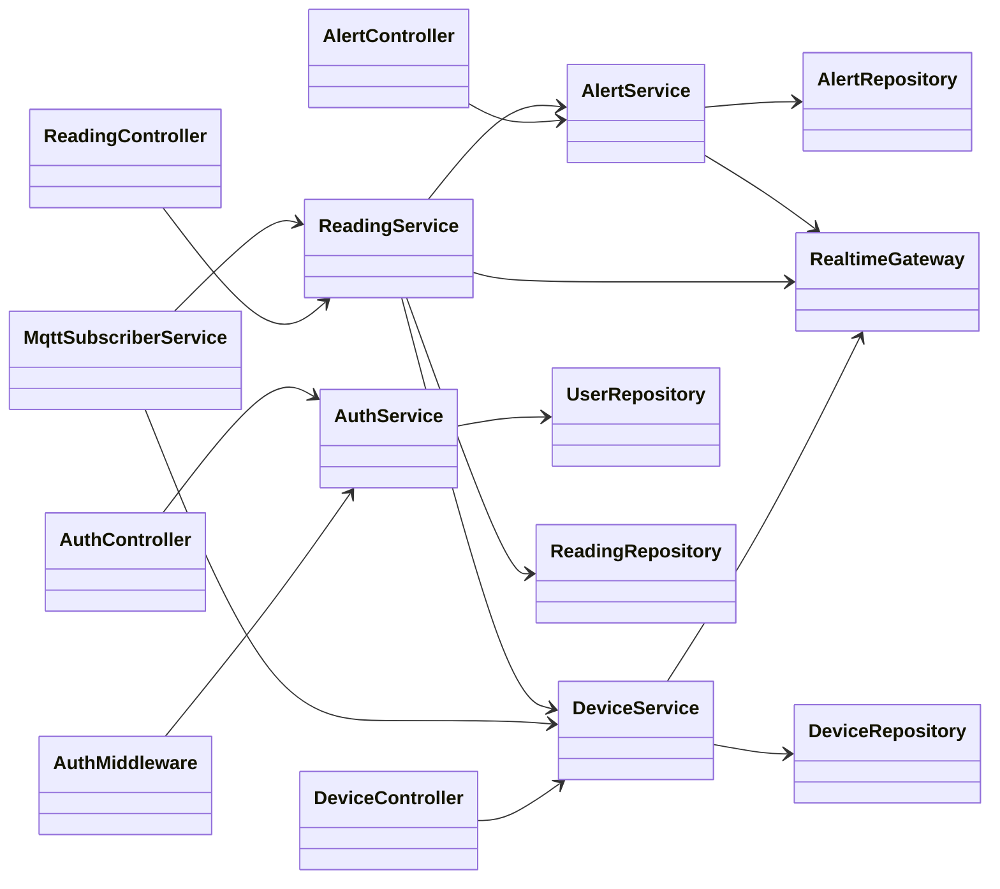
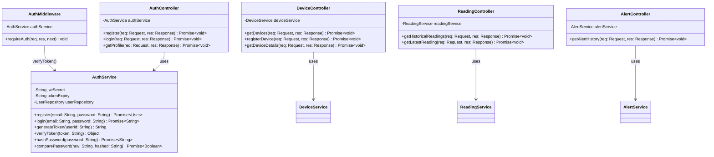
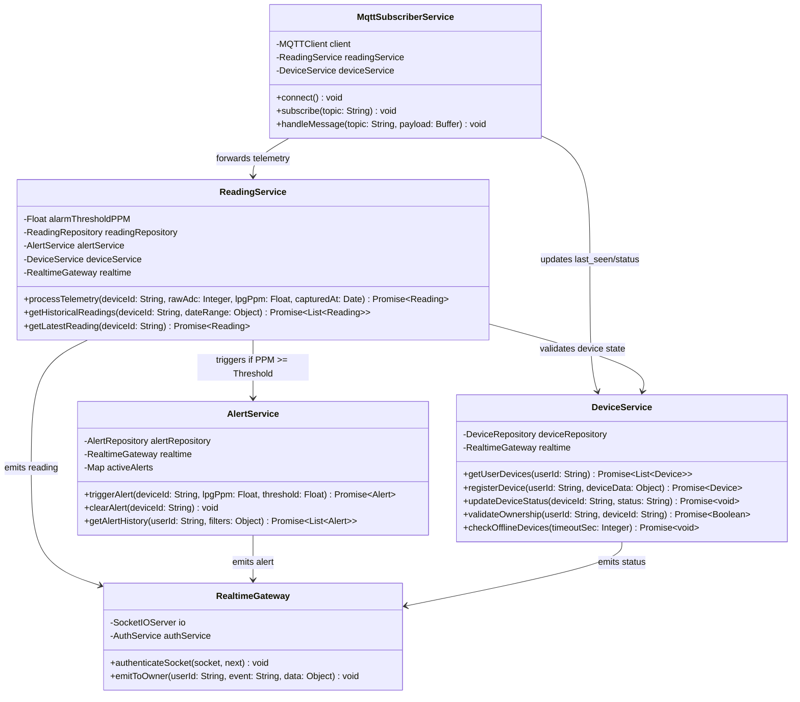
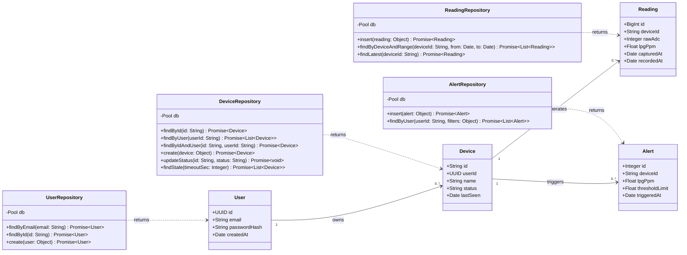

# Section 2.1: Backend Class Design (UML)

The backend follows a layered design: **Controllers → Services → Repositories → PostgreSQL**.
Every method called in the [Sequence Diagrams](stage-3-Sequence-Diagrams.md) is defined here, and every entity mirrors a table in the [ER Diagram](stage-3-ER-Diagram.md).

The design is shown in four small diagrams so each one stays readable:

| Diagram | Shows |
| --- | --- |
| 1.1 Overview | All classes and how the layers connect (no members) |
| 1.2 REST API Layer | Middleware, controllers, and `AuthService` |
| 1.3 Telemetry and Real-time Layer | MQTT ingestion, device, reading, and alert services, Socket.IO gateway |
| 1.4 Data Layer | Repositories and the entities they return |

---

## 1. Mermaid UML Class Diagrams

### 1.1 Overview

---

### 1.2 REST API Layer

`DeviceService`, `ReadingService`, and `AlertService` are shown here by name only; their attributes and methods are defined in 1.3. Every route except `register` and `login` passes through `AuthMiddleware` first.

---

### 1.3 Telemetry and Real-time Layer

---

### 1.4 Data Layer

---

## 2. Structural UML Class Relationships

### 1. `MqttSubscriberService` → `ReadingService` & `DeviceService` (Association)
Upon receiving a new MQTT packet from the ESP32 hardware via the telemetry or heartbeat topic, `MqttSubscriberService` parses the JSON payload and forwards the data to:
* **`ReadingService`**: To persist the raw 12-bit ADC value and the estimated LPG gas concentration ($PPM$) calculated on the ESP32 into the time-series database. The backend does not recalculate PPM, so the local alarm and the web alert always use the same value.
* **`DeviceService`**: To update the device's `last_seen` timestamp and set its operational network connectivity status to `online`.

---

### 2. `ReadingService` → `AlertService` (Dependency / Conditional Trigger)
`ReadingService` evaluates each ingested gas reading against configured safety limits. If the calculated gas level meets or exceeds the safety boundary ($PPM \ge \text{Threshold}$), `ReadingService` invokes `AlertService.triggerAlert()` to immediately create a persistent safety incident log within the `alert_events` audit table. `AlertService` records one alert per leak episode using `activeAlerts`; when a normal reading arrives, `ReadingService` calls `clearAlert()` to end the episode.

---

### 3. `Controllers` → `Services` (Direct Dependency)
To enforce strict **Separation of Concerns (SoC)** and multi-tenant data safety (`US-06`), HTTP REST API Controllers (`AuthController`, `DeviceController`, `ReadingController`, `AlertController`) delegate all core application processing, JWT validation, and database operations directly to their corresponding domain Service layers.

---

### 4. `Services` → `Repositories` (Data Access)
Each Service uses exactly one Repository, and Repositories are the only classes that execute SQL through the `pg` connection pool. This keeps business logic (Backend Developer) separate from data-access code (Database Developer), as defined in the Project Charter, and lets services be unit-tested with mock repositories.

---

### 5. `Services` → `RealtimeGateway` (Live Delivery)
`DeviceService`, `ReadingService`, and `AlertService` publish live events (`device:status`, `reading:new`, `alert:new`) through `RealtimeGateway.emitToOwner()`. The gateway authenticates each Socket.IO connection with the user's JWT and sends events only to the owner's room `user:{userId}`, so the data-isolation rule (`US-06`) is enforced in one place.

---

### 6. Offline Detection (`DeviceService.checkOfflineDevices()`)
A periodic check finds devices whose `last_seen` is older than the timeout, sets them to `offline` through `updateDeviceStatus()`, and emits `device:status` to the owner (`US-08`, Sequence 2 steps 17–20).
