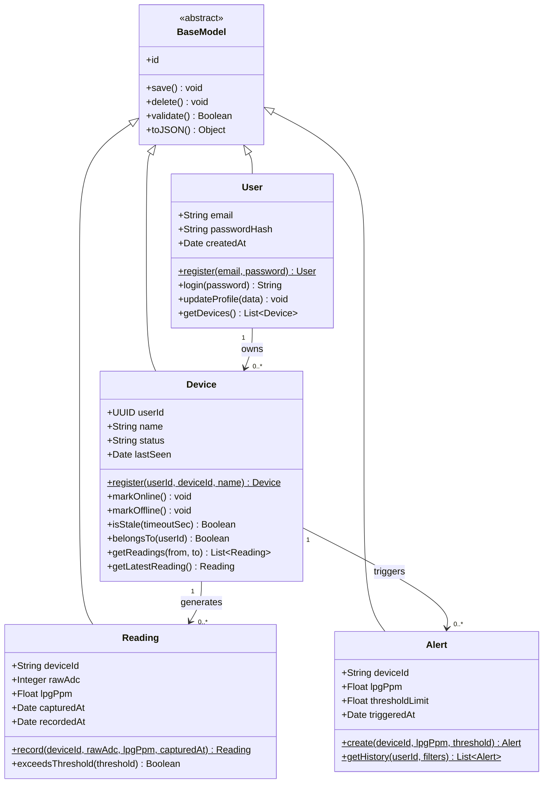
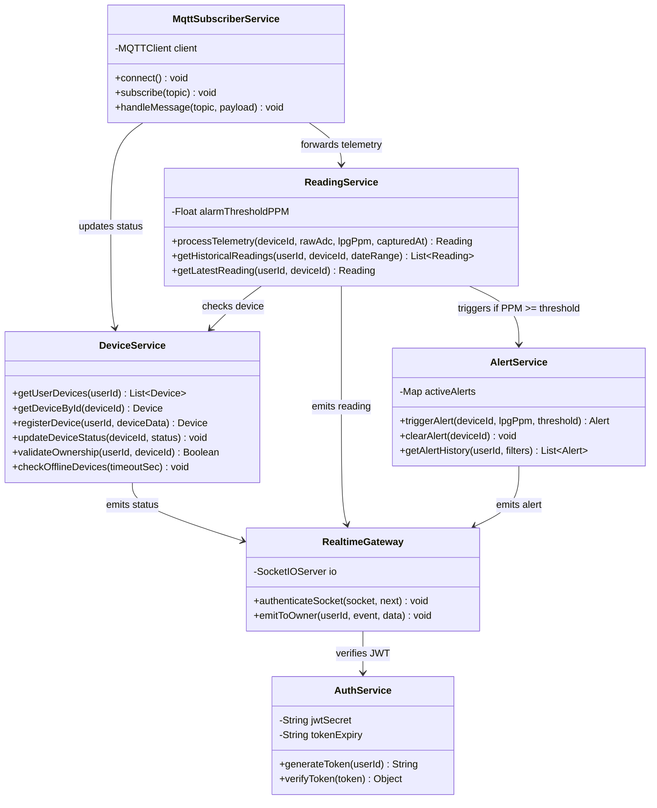

# Section 2.1: Class Diagram

The backend is designed around four domain classes that mirror the database tables in the [ER Diagram](stage-3-ER-Diagram.md). All four inherit common behavior from `BaseModel`. A thin service layer coordinates them and contains every method called in the [Sequence Diagrams](stage-3-Sequence-Diagrams.md).

---

## 1. Domain Model

### Class Descriptions

| Class | Table | Responsibility | User stories |
| --- | --- | --- | --- |
| `BaseModel` | — | Abstract parent. Holds the primary key `id` and the shared persistence methods: `save()` inserts or updates the row, `delete()` removes it, `validate()` checks required fields and types before saving, and `toJSON()` returns the object for the API. | — |
| `User` | `users` | A registered account. `register()` hashes the password with bcrypt and saves the user; `login()` compares the password and returns a JWT; `toJSON()` never includes `passwordHash`. `id` is a UUID. | US-01, US-05 |
| `Device` | `devices` | One ESP32 unit owned by one user. Tracks connectivity: `markOnline()` updates `lastSeen`, `isStale()` detects a device that stopped sending, and `belongsTo()` enforces data isolation. `id` is the hardware identifier (e.g. `ESP32-A1B2C3`). | US-05, US-06, US-08 |
| `Reading` | `sensor_readings` | One sensor observation. `lpgPpm` is calculated on the ESP32 and stored as received. `record()` ignores a repeated message with the same `(deviceId, capturedAt)`. | US-02, US-07 |
| `Alert` | `alert_events` | One leak episode where `lpgPpm` reached the threshold. Stores the value and the threshold that was crossed. | US-04, US-09 |

### Relationships

| Relationship | Type | Meaning |
| --- | --- | --- |
| `BaseModel` ◁— `User`, `Device`, `Reading`, `Alert` | Inheritance | Every domain class reuses `save()`, `delete()`, `validate()`, and `toJSON()`. |
| `User` 1 → 0..* `Device` | Association | A user owns zero or more devices; each device belongs to exactly one user (`US-14` sharing is out of scope). |
| `Device` 1 → 0..* `Reading` | Association | A device produces a continuous series of readings. |
| `Device` 1 → 0..* `Alert` | Association | A device can trigger many alerts over time, one per leak episode. |

---

## 2. Service Layer

Services coordinate the domain classes for each use case. Their method names match the Sequence Diagrams exactly.

### Service Descriptions

| Service | Uses | Responsibility | Sequence |
| --- | --- | --- | --- |
| `MqttSubscriberService` | `DeviceService`, `ReadingService` | Subscribes to `devices/+/telemetry`, validates each JSON message and the device identifier, and forwards valid readings. Invalid messages are logged and dropped. | 1, 2 |
| `DeviceService` | `Device` | Device registration, ownership checks, and online/offline status. `checkOfflineDevices()` runs periodically and marks stale devices `offline`. | 1, 2, 3 |
| `ReadingService` | `Reading` | Stores each reading, compares `lpgPpm` with `alarmThresholdPPM`, and returns history only after `validateOwnership()` succeeds. | 1, 2, 3 |
| `AlertService` | `Alert` | Creates one alert per leak episode using `activeAlerts`; `clearAlert()` ends the episode when a normal reading arrives. | 2 |
| `AuthService` | `User` | Issues and verifies the JWT that carries the user's `id`. | 3 |
| `RealtimeGateway` | `AuthService` | Authenticates Socket.IO connections and sends `reading:new`, `alert:new`, and `device:status` only to the owner's room `user:{userId}`. | 1, 2 |

### REST Controllers

Each controller reads the HTTP request, calls one service, and returns the status code and JSON. An authentication middleware verifies the JWT on every route except register and login, and passes `userId` to the controller.

| Controller | Calls | Routes |
| --- | --- | --- |
| `AuthController` | `User`, `AuthService` | `register`, `login`, `getProfile` |
| `DeviceController` | `DeviceService` | `getDevices`, `registerDevice`, `getDeviceDetails` |
| `ReadingController` | `ReadingService` | `getHistoricalReadings`, `getLatestReading` |
| `AlertController` | `AlertService` | `getAlertHistory` |
