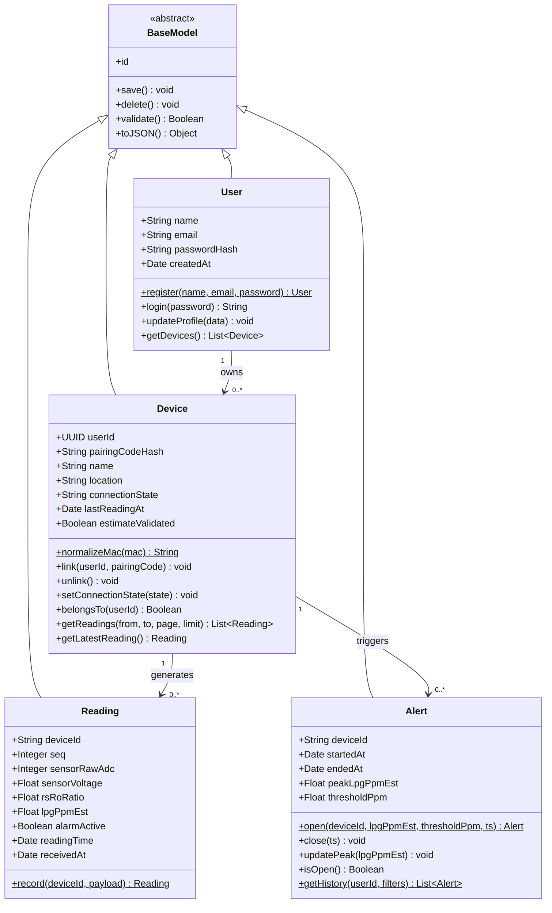
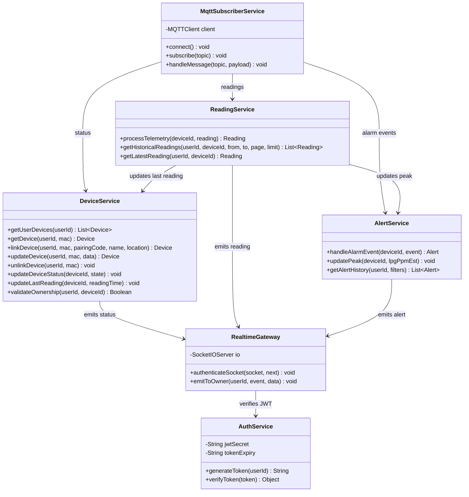
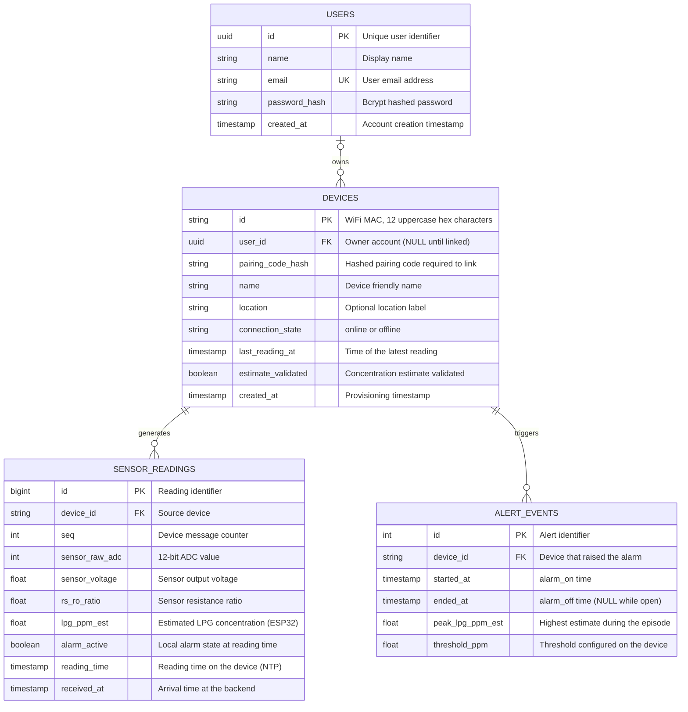
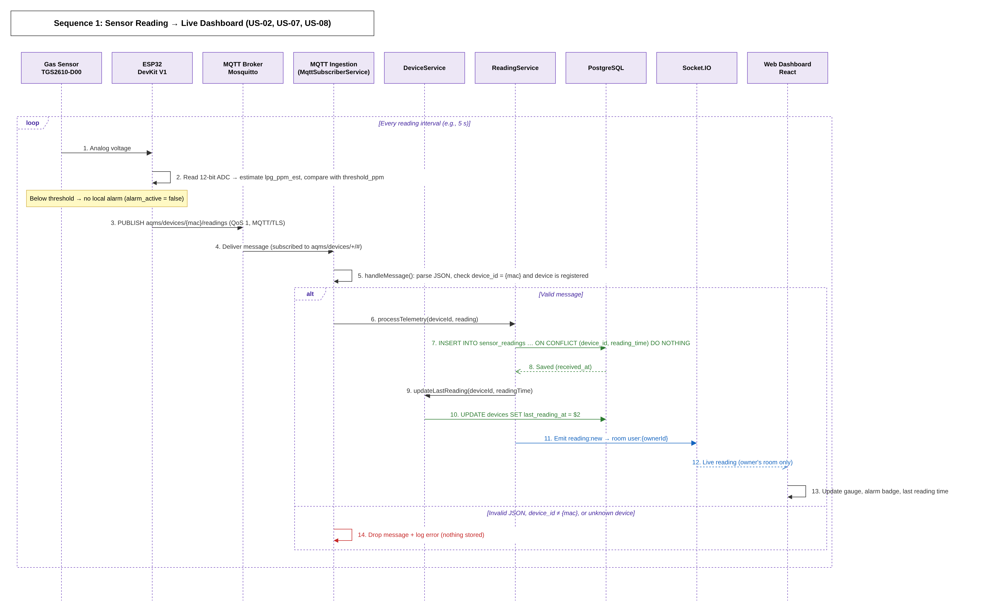
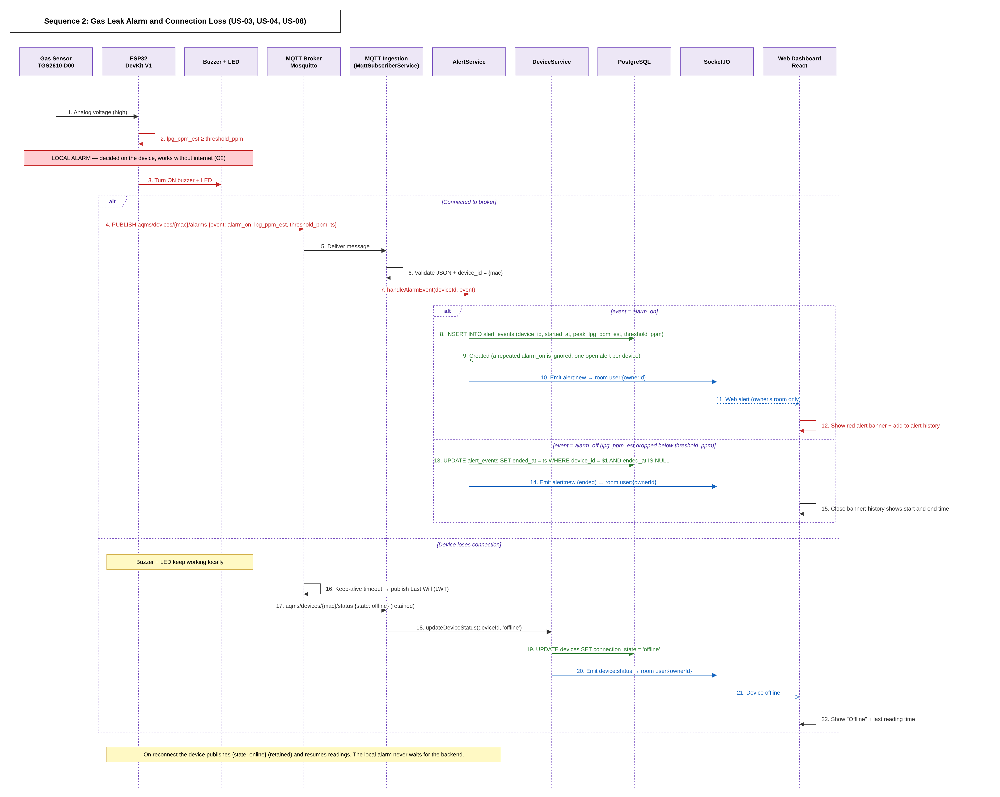
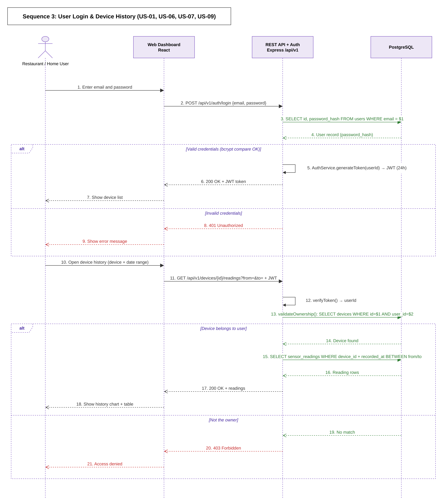

# Stage 3 Report: Technical Documentation

**Team:** SAU-0226-Team 15  
**Project:** Air Quality Monitoring System - LPG Leak Detection MVP  
**Repository:** `air-quality-monitoring-system`  
**Stage dates:** 27 September - 10 October 2026  
**Status:** Technical planning only; implementation starts in Stage 4 (11 October 2026).

This report is the single Stage 3 deliverable. It turns the objectives, scope, and risks in the [Project Charter](stage-2%20project%20charter.md) into a technical plan: what the system does, how its parts fit together, how data moves between them, and why each technology was chosen. Objective IDs (O1-O3) and risk IDs (R1-R4) refer to the charter; user-story IDs (US-01 to US-15) are defined in Section 1.

## Contents

1. [User Stories and Mockups](#1-user-stories-and-mockups)
2. [System Architecture](#2-system-architecture)
3. [Components, Classes, and Database Design](#3-components-classes-and-database-design)
4. [Sequence Diagrams](#4-sequence-diagrams)
5. [API Specifications](#5-api-specifications)
6. [SCM and QA Plans](#6-scm-and-qa-plans)
7. [Technical Justifications](#7-technical-justifications)

[Sources](#sources)

---

## 1. User Stories and Mockups

### 1.1 User Stories (MoSCoW Prioritization)

#### Must Have (Essential MVP Objectives)

Core operational requirements required for core system viability, covering Objectives **O1**, **O2**, and **O3**.

| ID | User Story | Priority | Target Objective / Scope |
| --- | --- | --- | --- |
| **US-01** | As a kitchen owner, I want to log in securely to my account, so that I can access and monitor my registered LPG devices. | **Must Have** | Accounts & Access (O3) |
| **US-02** | As a kitchen user, I want to view current sensor readings and estimated LPG concentration levels on the dashboard, so that I can monitor gas safety in real-time. | **Must Have** | Data Display & Sensor (O1) |
| **US-03** | As a kitchen user, I want the local device buzzer and LED to activate instantly when gas concentration exceeds the defined threshold, so that I am alerted to an LPG leak even without internet connectivity. | **Must Have** | Local Alarm & Hardware (O2) |
| **US-04** | As a kitchen owner, I want to see web alert notifications and historical alert logs on the dashboard when a leak occurs, so that I can track incident occurrences over time. | **Must Have** | Web Alerts & History (O1, O2) |
| **US-05** | As a restaurant owner, I want to add and monitor multiple gas detection devices under my single user account, so that I can manage safety across different kitchen areas simultaneously. | **Must Have** | Multi-device Support (O3) |
| **US-06** | As a user, I want my device data and history to be strictly isolated to my account, so that unauthorized users cannot access my operational data. | **Must Have** | Data Isolation & Security (O3) |
| **US-07** | As a kitchen owner, I want to view historical gas readings with timestamps by device, so that I can review past gas trends and audit safety logs. | **Must Have** | Data Storage & History (O1) |


#### Should Have (High-Value Reliability Features)

Features that enhance system usability and operational transparency.

| ID | User Story | Priority | Target Objective / Scope |
| --- | --- | --- | --- |
| **US-08** | As a kitchen owner, I want to see the device connectivity state (online/offline) and the latest reading timestamp on the dashboard, so that I know if the system is actively transmitting data. | **Should Have** | System Reliability (R3) |
| **US-09** | As a kitchen owner, I want to filter historical reading and alert logs by date range or specific device, so that I can quickly investigate specific safety events. | **Should Have** | Dashboard Usability |


#### Could Have (Desirable Enhancements)

Optional features to be implemented if time permits during Phase 4.

| ID | User Story | Priority | Target Objective / Scope |
| --- | --- | --- | --- |
| **US-10** | As a kitchen owner, I want to view the configured alarm threshold limit on the web dashboard, so that I know at what concentration level the local alarm will trigger. | **Could Have** | Dashboard Configuration |
| **US-11** | As a restaurant manager, I want to export historical gas readings and alert logs to a CSV file, so that I can archive safety reports internally. | **Could Have** | Data Reporting |


#### Won't Have (Out of MVP Scope)

Explicitly excluded features per the Project Charter to maintain scope integrity for this release.

| ID | User Story | Priority | Out of Scope Reason |
| --- | --- | --- | --- |
| **US-12** | As a kitchen owner, I want to receive SMS or WhatsApp alert messages during a gas leak event, so that I am notified when away from the dashboard. | **Won't Have** | Explicitly out of scope in Project Charter (MVP limits alerts to local hardware & web dashboard). |
| **US-13** | As a user, I want the system to automatically trigger a gas shut-off valve when a leak is detected, so that the gas supply is cut off automatically. | **Won't Have** | Out of scope due to safety certification, physical solenoid actuator complexity, and hardware constraints. |
| **US-14** | As a restaurant owner, I want to share access to the same device across multiple independent user accounts, so that external staff can log in separately. | **Won't Have** | Out of scope; enforcing strict single-account multi-device ownership rule for MVP simplicity. |
| **US-15** | As a user, I want to receive an OTP code to verify my account ownership upon sign-up, so that my account email is validated. | **Won't Have** | Out of scope for MVP to prevent external service dependencies; standard JWT & bcrypt password authentication provides sufficient access control. |

### 1.2 UI/UX Mockups

The interface is designed in Figma, as required by the mentors: [Figma design file](https://www.figma.com/design/k5UNJkKtfeYt9HBuPiIXqY/Untitled?node-id=0-1&p=f&t=Mank3nL8NS1aXxNC-0).

| Screen | Purpose | Key elements | User stories |
| --- | --- | --- | --- |
| Sign-in | Authenticate the user and start a session. | Email and password fields, validation messages. | US-01, US-06 |
| Devices overview (main dashboard) | Monitor every device on the account at a glance. | Device cards with `Online` / `Offline` badge, latest estimated concentration, latest reading time, alarm state. | US-02, US-05, US-08 |
| Device details | Watch one device live. | Live estimated-concentration gauge or chart (labeled as an estimate), threshold indicator, live alert banner. | US-02, US-04 |
| History and alert logs | Review past readings and leak episodes. | Filters by device and date range, readings table and chart, alert history with start, end, and peak values. | US-04, US-07, US-09 |

---

## 2. System Architecture


Editable source: [architecture.drawio](diagrams/architecture.drawio)

| # | Flow | Description |
| --- | --- | --- |
| ① | Sensor → ESP32 | Analog voltage read by the 12-bit ADC |
| ② | ESP32 → Buzzer + LED | Local alarm when `lpg_ppm_est` ≥ `threshold_ppm`; decided on the device, works without internet |
| ③ | ESP32 → MQTT Broker | Publish to `aqms/devices/{mac}/readings`, `/alarms`, and `/status` over MQTT/TLS (QoS 1); each device has its own broker credentials. The broker publishes the device's Last Will (`offline`) if it drops |
| ④ | Broker → MQTT Ingestion | `MqttSubscriberService` subscribes to `aqms/devices/+/#`, validates each message, and routes it by topic |
| ⑤ | Ingestion → Reading Service | Readings are validated and stored |
| ⑥ | Ingestion → Alert Service | `alarm_on` opens an alert episode, `alarm_off` closes it |
| ⑦ | Services → Socket.IO | Live readings and alerts |
| ⑧ | Socket.IO → Dashboard | Live updates to the owner's room only |
| ⑨ | Dashboard ↔ REST API | HTTPS + JWT (`/api/v1`) |
| ⑩ | Services → PostgreSQL | Save readings, alerts, and device status |
| ⑪ | REST API ↔ PostgreSQL | Historical queries |
| ⑫ | User ↔ Dashboard | Web browser |
| ⑬ | NTP → ESP32 | Time sync for TLS certificates and the `reading_time` of each reading |

---

## 3. Components, Classes, and Database Design

### 3.1 System Components

The system has five tiers. The local alarm runs entirely on the edge tier, so a network failure affects only the web features.

| Tier | Component | Responsibilities |
| --- | --- | --- |
| Edge hardware | ESP32 DevKit V1, Figaro TGS2610-D00 sensor, buzzer, LED | Reads the sensor through a voltage divider on a 12-bit ADC1 pin, calculates `lpg_ppm_est`, and turns on the buzzer and LED when `lpg_ppm_est` ≥ `threshold_ppm`, with or without internet. Identifies itself by its WiFi MAC address and publishes to `aqms/devices/{mac}/readings` (every reading interval), `aqms/devices/{mac}/alarms` (`alarm_on` / `alarm_off`), and `aqms/devices/{mac}/status` (`online`, with a Last Will of `offline`). |
| MQTT broker | Eclipse Mosquitto | Receives device messages over MQTT/TLS. Authenticates each device with its own username and password and applies an ACL so a device can publish only under its own `aqms/devices/{mac}/` topics. Publishes a device's Last Will when it stops responding. |
| Backend | Node.js, Express, MQTT.js, Socket.IO | Subscribes to `aqms/devices/+/#`, rejects messages whose `device_id` does not match the topic, and stores readings, alert episodes, and connection state. The alarm decision and `lpg_ppm_est` come from the device and are stored as received, so the local alarm and the web alert come from the same decision. Exposes the JWT-protected REST API (`/api/v1`) and pushes live events to each owner's Socket.IO room. |
| Database | PostgreSQL | Stores accounts (`users`), devices (`devices`), time-series readings (`sensor_readings`), and leak episodes (`alert_events`). |
| Frontend | React single-page application | Shows live estimates, connection badges, alert banners, and filterable history through REST and Socket.IO. |

```text
[ Edge Hardware ]            [ MQTT Broker ]           [ Backend ]                  [ Frontend ]
+--------------------+       +----------------+        +-------------------+         +-------------------+
| ESP32 DevKit V1    |       | Mosquitto      |        | Node.js / Express |         | React Dashboard   |
| - TGS2610-D00      |-MQTT->| aqms/devices/  |<-sub---| - MQTT ingestion  |<-REST-->| - Sign-in         |
| - Buzzer + LED     | (TLS) |   {mac}/#      |        | - REST API (JWT)  |         | - Device cards    |
| (local alarm)      |       | ACL per device |        | - Socket.IO       |--push-->| - Live + history  |
+--------------------+       +----------------+        +---------+---------+         +-------------------+
                                                                 |
                                                           [ PostgreSQL ]
```

### 3.2 Frontend Components

The component names below are proposed from the screen plan and the API; the frontend developer will match them to the final Figma frames.

| Component | Screen | Data source | User stories |
| --- | --- | --- | --- |
| `LoginPage` | Sign-in | `POST /auth/login` | US-01 |
| `AuthProvider` | All | Keeps the JWT and user; calls `GET /auth/me` on reload; returns to sign-in on `401` | US-01, US-06 |
| `ProtectedRoute` | All except sign-in | Blocks pages until the user is signed in | US-06 |
| `DevicesOverviewPage` | Devices overview | `GET /devices`; `device:status` and `reading:new` events | US-02, US-05, US-08 |
| `DeviceCard` | Devices overview | Badge, latest estimate, latest reading time, alarm state for one device | US-02, US-08 |
| `AddDeviceForm` | Devices overview | `POST /devices` with MAC address, pairing code, name, and location | US-05 |
| `DeviceDetailsPage` | Device details | `GET /devices/:mac`, `GET /devices/:mac/readings/latest`, `reading:new` | US-02 |
| `LiveGauge` | Device details | Current `lpg_ppm_est`, labeled as an estimate | US-02 |
| `AlertBanner` | Overview and details | `alert:new` | US-04 |
| `HistoryPage` | History and alert logs | Device and date-range filters | US-07, US-09 |
| `ReadingsChart`, `ReadingsTable` | History and alert logs | `GET /devices/:mac/readings` with pagination | US-07, US-09 |
| `AlertHistoryList` | History and alert logs | `GET /alerts`, `GET /devices/:mac/alerts` | US-04, US-09 |
| `apiClient` | — | Adds `Authorization: Bearer <token>` and reads the shared error format | US-06 |
| `socketClient` | — | Connects to Socket.IO with the JWT; after a reconnect, reloads the latest state through REST | US-02, US-08 |

### 3.3 Backend Class Diagram

The backend is designed around four domain classes that mirror the database tables in the [ER Diagram](#34-er-diagram). All four inherit common behavior from `BaseModel`. A thin service layer coordinates them and contains every method called in the [Sequence Diagrams](#4-sequence-diagrams). Field names, topics, and endpoints follow the [API Specifications](#5-api-specifications).

#### Domain Model



#### Class Descriptions

| Class | Table | Responsibility | User stories |
| --- | --- | --- | --- |
| `BaseModel` | — | Abstract parent. Holds the primary key `id` and the shared persistence methods: `save()` inserts or updates the row, `delete()` removes it, `validate()` checks required fields and types before saving, and `toJSON()` returns the object for the API. | — |
| `User` | `users` | A registered account. `register()` hashes the password with bcrypt and saves the user (`409` if the email exists); `login()` compares the password and returns a JWT; `toJSON()` returns only `id`, `name`, and `email`. `id` is a UUID. | US-01, US-05 |
| `Device` | `devices` | One ESP32 unit. `id` is its WiFi MAC in 12 uppercase hex characters; `normalizeMac()` removes `:` or `-` and converts to uppercase. `link()` attaches the device to an account only if the pairing code matches and it is not already linked. `setConnectionState()` applies `online` / `offline` from the status topic. `belongsTo()` enforces data isolation. | US-05, US-06, US-08 |
| `Reading` | `sensor_readings` | One sensor observation. `lpgPpmEst` and `alarmActive` come from the ESP32 and are stored as received. `record()` ignores a repeated message with the same `(deviceId, readingTime)`. | US-02, US-07 |
| `Alert` | `alert_events` | One leak episode. `open()` runs on `alarm_on`, `close()` on `alarm_off`, and `updatePeak()` keeps the highest estimate while the alert is open. A device has at most one open alert. | US-04, US-09 |

#### Relationships

| Relationship | Type | Meaning |
| --- | --- | --- |
| `BaseModel` ◁— `User`, `Device`, `Reading`, `Alert` | Inheritance | Every domain class reuses `save()`, `delete()`, `validate()`, and `toJSON()`. |
| `User` 1 → 0..* `Device` | Association | A user owns zero or more devices; each device belongs to at most one user (`US-14` sharing is out of scope). |
| `Device` 1 → 0..* `Reading` | Association | A device produces a continuous series of readings. |
| `Device` 1 → 0..* `Alert` | Association | A device can trigger many alerts over time, one per leak episode. |

#### Service Layer

Services coordinate the domain classes for each use case. Their method names match the Sequence Diagrams exactly.



#### Service Descriptions

| Service | Uses | Responsibility | Sequence |
| --- | --- | --- | --- |
| `MqttSubscriberService` | `ReadingService`, `AlertService`, `DeviceService` | Subscribes to `aqms/devices/+/#`, rejects messages whose `device_id` does not match `{mac}` or belongs to an unregistered device, and routes by topic: `readings`, `alarms`, `status`. | 1, 2 |
| `DeviceService` | `Device` | Linking with a pairing code, ownership checks, and connection state. `updateDeviceStatus()` handles both `online` and the broker's Last Will `offline`. | 1, 2, 3 |
| `ReadingService` | `Reading` | Stores each reading, updates the device's `last_reading_at`, and returns paginated history only after `validateOwnership()` succeeds. | 1, 3 |
| `AlertService` | `Alert` | `handleAlarmEvent()` opens an alert on `alarm_on` and closes it on `alarm_off`; the alarm decision itself is made on the device. | 2 |
| `AuthService` | `User` | Issues and verifies the JWT that carries the user's `id`. | 3 |
| `RealtimeGateway` | `AuthService` | Authenticates Socket.IO connections and sends `reading:new`, `alert:new`, and `device:status` only to the owner's room `user:{userId}`. | 1, 2 |

#### REST Controllers

Each controller reads the HTTP request, calls one service, and returns the status code and JSON. An authentication middleware verifies the JWT on every route except register, login, and health, and passes `userId` to the controller. A device that belongs to another account returns `404`, so the API does not reveal that it exists.

| Controller | Calls | Endpoints (`/api/v1`) |
| --- | --- | --- |
| `AuthController` | `User`, `AuthService` | `POST /auth/register`, `POST /auth/login`, `GET /auth/me` |
| `DeviceController` | `DeviceService` | `GET /devices`, `POST /devices`, `GET /devices/:mac`, `PATCH /devices/:mac`, `DELETE /devices/:mac` |
| `ReadingController` | `ReadingService` | `GET /devices/:mac/readings`, `GET /devices/:mac/readings/latest` |
| `AlertController` | `AlertService` | `GET /alerts`, `GET /devices/:mac/alerts` |
| `HealthController` | — | `GET /health` |

### 3.4 ER Diagram



### 3.5 Database Schema

The LPG Leak Detection System uses a relational **PostgreSQL** database designed for time-series writes, relational integrity, and data isolation between accounts. Field names follow the [API Specifications](#5-api-specifications). The schema has four tables:

1. `users`: Registered accounts.
2. `devices`: ESP32 units, identified by their WiFi MAC address.
3. `sensor_readings`: Time-series readings published by each device.
4. `alert_events`: One row per leak episode, from `alarm_on` to `alarm_off`.

#### Table: `users`
Stores restaurant and home-kitchen users with hashed credentials.

| Column | Data Type | Constraints | Description |
| :--- | :--- | :--- | :--- |
| `id` | `UUID` | PRIMARY KEY, DEFAULT `gen_random_uuid()` | Unique account identifier |
| `name` | `VARCHAR(100)` | NOT NULL | Display name |
| `email` | `VARCHAR(255)` | UNIQUE, NOT NULL | Login email address (`409` if already registered) |
| `password_hash` | `VARCHAR(255)` | NOT NULL | Bcrypt hash; never returned by the API |
| `created_at` | `TIMESTAMPTZ` | DEFAULT `CURRENT_TIMESTAMP` | Account creation timestamp |

---

#### Table: `devices`
Tracks each ESP32 unit and the account it is linked to.

| Column | Data Type | Constraints | Description |
| :--- | :--- | :--- | :--- |
| `id` | `CHAR(12)` | PRIMARY KEY, CHECK (`id ~ '^[0-9A-F]{12}$'`) | WiFi MAC address, 12 uppercase hex characters (e.g., `A4CF123B9E01`) |
| `user_id` | `UUID` | FOREIGN KEY (`users.id`), NULL | Owner account; NULL until the device is linked |
| `pairing_code_hash` | `VARCHAR(255)` | NOT NULL | Hash of the pairing code required by `POST /devices` |
| `name` | `VARCHAR(100)` | NULL | Friendly label (e.g., "Main kitchen") |
| `location` | `VARCHAR(100)` | NULL | Optional location label (e.g., "Restaurant A") |
| `connection_state` | `VARCHAR(10)` | DEFAULT `'offline'`, CHECK (`connection_state IN ('online', 'offline')`) | Set from the device's `status` topic, including the broker's Last Will |
| `last_reading_at` | `TIMESTAMPTZ` | NULL | `reading_time` of the latest stored reading |
| `estimate_validated` | `BOOLEAN` | DEFAULT `FALSE` | Whether the concentration estimate has passed reference testing |
| `created_at` | `TIMESTAMPTZ` | DEFAULT `CURRENT_TIMESTAMP` | When the device was provisioned |

A device row is provisioned with its MAC and pairing code when the firmware is flashed. `POST /devices` sets `user_id` only if the pairing code matches and the device is not already linked (`409` otherwise). `DELETE /devices/:mac` sets `user_id` back to NULL.

---

#### Table: `sensor_readings`
Time-series storage for readings published to `aqms/devices/{mac}/readings`.

| Column | Data Type | Constraints | Description |
| :--- | :--- | :--- | :--- |
| `id` | `BIGSERIAL` | PRIMARY KEY | Reading identifier |
| `device_id` | `CHAR(12)` | FOREIGN KEY (`devices.id`), NOT NULL | Source device |
| `seq` | `INTEGER` | NULL | Device message counter, used to detect lost or repeated messages in tests |
| `sensor_raw_adc` | `INTEGER` | NOT NULL, CHECK (`sensor_raw_adc BETWEEN 0 AND 4095`) | 12-bit ADC value |
| `sensor_voltage` | `REAL` | NULL | Sensor output voltage |
| `rs_ro_ratio` | `REAL` | NULL | Sensor resistance ratio used for the estimate |
| `lpg_ppm_est` | `REAL` | NOT NULL | LPG concentration estimate calculated on the ESP32; accuracy not yet established |
| `alarm_active` | `BOOLEAN` | NOT NULL | Local alarm state when the reading was taken |
| `reading_time` | `TIMESTAMPTZ` | NOT NULL | Device time (`ts`, NTP-synchronized); set to `received_at` if the device clock is not synchronized |
| `received_at` | `TIMESTAMPTZ` | DEFAULT `CURRENT_TIMESTAMP` | Arrival time at the backend |

**Table constraint:** `UNIQUE (device_id, reading_time)` — MQTT QoS 1 can deliver the same message more than once; the backend inserts with `ON CONFLICT DO NOTHING` so a repeated message is stored only once.

---

#### Table: `alert_events`
One row per leak episode reported on `aqms/devices/{mac}/alarms`.

| Column | Data Type | Constraints | Description |
| :--- | :--- | :--- | :--- |
| `id` | `SERIAL` | PRIMARY KEY | Alert identifier |
| `device_id` | `CHAR(12)` | FOREIGN KEY (`devices.id`), NOT NULL | Device that raised the alarm |
| `started_at` | `TIMESTAMPTZ` | NOT NULL | `ts` of the `alarm_on` event |
| `ended_at` | `TIMESTAMPTZ` | NULL | `ts` of the `alarm_off` event; NULL while the alarm is active |
| `peak_lpg_ppm_est` | `REAL` | NOT NULL | Highest estimate during the episode, updated by readings while the alert is open |
| `threshold_ppm` | `REAL` | NOT NULL | Threshold configured on the device when the alarm turned on |

**Open-alert rule:** `CREATE UNIQUE INDEX one_open_alert ON alert_events (device_id) WHERE ended_at IS NULL` — a device can have only one open alert, so a repeated `alarm_on` message does not create a second episode.

#### Indexes

| Index | Columns | Supports |
| :--- | :--- | :--- |
| `idx_readings_device_time` | `sensor_readings (device_id, reading_time DESC)` | History by device and date range (`US-07`, `US-09`) and the latest reading per device (`US-02`) |
| `idx_alerts_device_time` | `alert_events (device_id, started_at DESC)` | Alert history by device and date range (`US-04`, `US-09`) |
| `one_open_alert` | `alert_events (device_id) WHERE ended_at IS NULL` | One open alert per device |
| `idx_devices_user` | `devices (user_id)` | Listing a user's devices and ownership checks (`US-05`, `US-06`) |

Device credentials for the MQTT broker are stored in the Mosquitto password file, not in this database, so the backend database never holds broker secrets.

---

## 4. Sequence Diagrams

Topics, payloads, endpoints, and status codes follow the [API Specifications](#5-api-specifications). Editable sources (draw.io): [seq-1](diagrams/seq-1-sensor-reading.drawio) · [seq-2](diagrams/seq-2-gas-leak-alarm.drawio) · [seq-3](diagrams/seq-3-login-history.drawio)

### 4.1 Sensor Reading to Live Dashboard (US-02, US-07, US-08)



On every reading interval the ESP32 estimates the concentration, checks it against the threshold, and publishes the reading with QoS 1. The ingestion service accepts the message only if the payload's `device_id` matches the `{mac}` in the topic and the device is registered. The reading is inserted with `ON CONFLICT (device_id, reading_time) DO NOTHING`, so a repeated QoS 1 delivery is stored once. The reading is then sent only to the owner's room. Invalid messages are dropped and logged, and nothing is stored.

### 4.2 Gas Leak Alarm and Connection Loss (US-03, US-04, US-08)



The ESP32 decides the alarm and turns on the buzzer and LED before any network step, so the local alarm never waits for the backend (O2). When the device is connected, `alarm_on` opens one alert episode (a repeated `alarm_on` is ignored) and `alarm_off` closes it; each change is pushed to the dashboard. When the device loses its connection, the buzzer and LED keep working, the broker publishes the device's Last Will (`offline`) after the keep-alive timeout, and the dashboard shows `Offline` with the latest reading time (R3).

### 4.3 User Login and Device History (US-01, US-06, US-07, US-09)



A successful login returns a JWT; wrong credentials return `401`. For a history request, the backend verifies the token and then checks ownership with one query on `devices` filtered by both device and user. If the device belongs to the user, it returns paginated readings for the date range. Otherwise it returns `404 DEVICE_NOT_FOUND`, which does not reveal whether the device exists (O3).

---

## 5. API Specifications

This section describes the external services the system depends on, the MQTT interface between each device and the backend, the REST API the web dashboard uses, and the real-time events pushed to the dashboard.

```
ESP32 (TGS2610-D00) --MQTT--> Broker --MQTT--> Node.js/Express --REST + Socket.IO--> Web Dashboard
                                                     |
                                                  Database
```

---

### 5.1 External Services and APIs

| Service | Purpose in the MVP | Why chosen |
|---|---|---|
| **MQTT Broker** (Eclipse Mosquitto, self-hosted, or HiveMQ Cloud free tier) | Carries messages from each ESP32 to the Node.js backend: readings, alarm events, and connection state | MQTT is lightweight and suited to constrained IoT devices. Its publish/subscribe model lets new devices be added without backend changes. It supports QoS 1 delivery, and its Last Will and Testament (LWT) feature reports a device as offline automatically, which supports the connection-state requirement and risk R3. |
| **NTP** (`pool.ntp.org`) | Synchronizes the ESP32 clock so each reading carries an accurate reading time | Objective O1 requires readings stored with their reading time. The backend also records its own receive time as a fallback if the device clock is not synchronized. |

**External APIs deliberately not used:**

- **SMS/WhatsApp providers** (e.g., Twilio) are out of scope for this version, as stated in the project charter.
- **Outdoor air-quality APIs** (OpenAQ, OpenWeatherMap) do not apply. The system measures indoor LPG at a specific kitchen, not outdoor air pollution.

---

### 5.2 Device-to-Backend Interface (MQTT)

#### Device identification

Each ESP32 uses its factory-assigned **WiFi MAC address** as its unique identifier, read in firmware with `WiFi.macAddress()`. This lets several devices run on the same WiFi network with no per-device code changes.

| Use | Format | Example |
|---|---|---|
| `device_id` (topics, payloads, URLs, database) | 12 uppercase hex characters, no separators | `A4CF123B9E01` |
| Display in the dashboard | Colon-separated | `A4:CF:12:3B:9E:01` |
| MQTT Client ID | `aqms-` + `device_id` | `aqms-A4CF123B9E01` |

- The backend normalizes any MAC it receives (removes `:` or `-`, converts to uppercase) before storing or comparing it.
- The separator-free form is used in topics and URLs because it is simpler to parse and needs no escaping.
- A unique Client ID per device is required: if two devices connect with the same Client ID, the broker disconnects the first one.
- **The MAC address is an identifier, not a secret.** It is visible to anyone on the same network, so it is not enough on its own to link a device to an account. Linking also requires a `pairing_code` (see `POST /devices`).

#### Topics

Each device authenticates to the broker with its own credentials. The backend subscribes to `aqms/devices/+/#`.

| Topic | Direction | QoS | Retained | Sent when |
|---|---|---|---|---|
| `aqms/devices/{mac}/readings` | Device → Backend | 1 | No | Every reading interval (e.g., 5 s) |
| `aqms/devices/{mac}/alarms` | Device → Backend | 1 | No | When the local alarm turns on or off |
| `aqms/devices/{mac}/status` | Device → Backend | 1 | Yes | On connect (`online`); the broker publishes the LWT message (`offline`) if the device drops |

The backend rejects any message whose `device_id` in the payload does not match the `{mac}` in the topic, or that belongs to an unregistered device.

Delivery uses QoS 1, so the broker acknowledges each message with PUBACK. This confirms receipt by the broker, not storage by the backend. If the connection drops, the device keeps its local alarm running and retries the connection.

#### Reading payload

```json
{
  "device_id": "A4CF123B9E01",
  "seq": 1024,
  "sensor_raw_adc": 1834,
  "sensor_voltage": 1.48,
  "rs_ro_ratio": 0.62,
  "lpg_ppm_est": 420,
  "alarm_active": false,
  "ts": "2026-10-07T15:30:00Z"
}
```

- `lpg_ppm_est` is an **estimate** whose accuracy has not yet been established (see Measurement and Safety Boundaries in the project charter).
- `seq` is a counter that helps detect lost or duplicate messages during disconnection tests.

#### Alarm event payload

```json
{
  "device_id": "A4CF123B9E01",
  "event": "alarm_on",
  "lpg_ppm_est": 1250,
  "threshold_ppm": 1000,
  "ts": "2026-10-07T15:31:10Z"
}
```

`event` is either `alarm_on` or `alarm_off`. The alarm decision is made on the device, so the buzzer and LED work without internet (O2). This message only reports the event to the web system.

#### Status payload

```json
{
  "device_id": "A4CF123B9E01",
  "state": "online",
  "ip": "192.168.1.23",
  "ts": "2026-10-07T15:29:58Z"
}
```

`ip` is informational only and helps when debugging several devices on one network. Devices are never identified by IP, because the router can change it.

---

### 5.3 Internal REST API (Express)

- **Base URL:** `/api/v1`
- **Format:** JSON request and response bodies
- **Authentication:** JWT in the header `Authorization: Bearer <token>`. Every endpoint requires it except register, login, and health.
- **Authorization rule (O3):** Every device, reading, and alert query is filtered by the signed-in user's ID. A request for another account's device returns `404`, not `403`, so the API does not reveal that the device exists.

#### Authentication

| Method | Path | Input | Success output |
|---|---|---|---|
| POST | `/auth/register` | Body: `{ "name", "email", "password" }` | `201` `{ "user": { "id", "name", "email" } }` |
| POST | `/auth/login` | Body: `{ "email", "password" }` | `200` `{ "token", "user": { "id", "name", "email" } }` |
| GET | `/auth/me` | None | `200` `{ "id", "name", "email" }` |

#### Devices

| Method | Path | Input | Success output |
|---|---|---|---|
| GET | `/devices` | None | `200` list of the user's devices with their latest state |
| POST | `/devices` | Body: `{ "mac_address", "pairing_code", "name", "location" }` | `201` the linked device. `400` if the MAC format is invalid; `409` if the device is already linked to another account |
| GET | `/devices/:mac` | None | `200` one device with its latest reading |
| PATCH | `/devices/:mac` | Body: `{ "name"?, "location"? }` | `200` the updated device |
| DELETE | `/devices/:mac` | None | `204` unlinks the device from the account |

`POST /devices` accepts the MAC with or without colons; the backend normalizes it.

Example `GET /devices` response:

```json
[
  {
    "device_id": "A4CF123B9E01",
    "mac_display": "A4:CF:12:3B:9E:01",
    "name": "Main kitchen",
    "location": "Restaurant A",
    "connection_state": "online",
    "last_reading_at": "2026-10-07T15:30:00Z",
    "latest": { "lpg_ppm_est": 420, "alarm_active": false },
    "estimate_validated": false
  },
  {
    "device_id": "A4CF123B9E7F",
    "mac_display": "A4:CF:12:3B:9E:7F",
    "name": "Grill station",
    "location": "Restaurant A",
    "connection_state": "offline",
    "last_reading_at": "2026-10-07T14:52:18Z",
    "latest": { "lpg_ppm_est": 95, "alarm_active": false },
    "estimate_validated": false
  }
]
```

#### Readings

| Method | Path | Input | Success output |
|---|---|---|---|
| GET | `/devices/:mac/readings` | Query: `from`, `to` (ISO 8601), `page` (default 1), `limit` (default 100, max 1000) | `200` `{ "data": [ readings ], "page", "limit", "total" }` |
| GET | `/devices/:mac/readings/latest` | None | `200` the most recent reading |

Each reading in `data`:

```json
{
  "id": 88213,
  "lpg_ppm_est": 420,
  "sensor_voltage": 1.48,
  "alarm_active": false,
  "reading_time": "2026-10-07T15:30:00Z",
  "received_at": "2026-10-07T15:30:01Z"
}
```

#### Alerts

| Method | Path | Input | Success output |
|---|---|---|---|
| GET | `/alerts` | Query: `device_id`?, `from`?, `to`?, `page`?, `limit`? | `200` paginated alert history across all of the user's devices |
| GET | `/devices/:mac/alerts` | Query: `from`?, `to`?, `page`?, `limit`? | `200` paginated alert history for one device |

Each alert:

```json
{
  "id": 517,
  "device_id": "A4CF123B9E01",
  "started_at": "2026-10-07T15:31:10Z",
  "ended_at": "2026-10-07T15:34:45Z",
  "peak_lpg_ppm_est": 1310,
  "threshold_ppm": 1000
}
```

#### Health

| Method | Path | Input | Success output |
|---|---|---|---|
| GET | `/health` | None | `200` `{ "status": "ok", "db": "up", "mqtt": "connected" }` |

#### Error format

All errors use one shape:

```json
{ "error": { "code": "DEVICE_NOT_FOUND", "message": "Device not found." } }
```

| Status | When |
|---|---|
| 400 | Invalid input (missing field, bad date, invalid MAC, `limit` too large) |
| 401 | Missing, invalid, or expired token; wrong login credentials |
| 404 | Resource not found, **or it belongs to another account** |
| 409 | Email already registered; device already linked to an account |
| 500 | Unexpected server error |

---

### 5.4 Real-Time Updates (WebSocket via Socket.IO)

So the dashboard shows new readings and alerts without refreshing, the backend pushes events over Socket.IO. The client connects with its JWT, and the server places it only in rooms for that user's devices, so the O3 access rule applies here too.

| Event | Payload |
|---|---|
| `reading:new` | Same shape as one reading, plus `device_id` |
| `alert:new` | Same shape as one alert (sent on `alarm_on`, updated on `alarm_off`) |
| `device:status` | `{ "device_id", "state": "online" \| "offline", "ts" }` |

---

> **Note:** The reading interval, `threshold_ppm`, and pagination limits shown above are placeholders. The final alarm threshold will be set in Stage 4 after testing the TGS2610-D00 sensor, with reference to SASO GSO 1611 and the manufacturer's documentation (see Measurement and Safety Boundaries in the project charter).

---

## 6. SCM and QA Plans

### 6.1 SCM Strategy

**Tool:** Git for version control, with GitHub to host the shared repository.

**Branching strategy:**
- `main`: stable, working version. No one commits directly to it.
- `develop`: integration branch. Each member merges finished work here for testing.
- `feature/<task-name>`: one branch per task (e.g., `feature/esp32-alarm`).

**Commits:** Small, frequent commits after each small change, with clear messages describing what was done (e.g., "add gas threshold check").

**Pull requests & code review:**
- Feature branches are merged into `develop` only through a pull request.
- Each PR is reviewed and approved by one other team member before merging. One reviewer keeps the process fast for a three-person team.
- `develop` is merged into `main` through a PR once it is stable and tested, for example after a feature is complete or before a demo.

### 6.2 QA Strategy

**Types of tests (mapped to the project objectives):**
- **O1 – Readings reach the dashboard:** End-to-end test from the device to the dashboard, comparing values at each step. Supported by integration tests for backend message ingestion and storage.
- **O2 – Local alarm without internet:** Physical (manual) test on the real device, including an internet outage. Supported by unit tests for the threshold-check logic. Software-trigger tests are recorded separately from physical sensor-response tests.
- **O3 – Access control:** Integration tests that send API requests as a second account and verify that access to another user's devices is rejected. Multi-device support is also tested manually with two physical devices.

**Tools:**
- **Backend:** Jest and Supertest for automated tests; Postman for manual API testing.
- **Frontend:** React Testing Library for component tests; manual testing in the browser against the Figma designs.
- **ESP32:** Serial Monitor to check readings and alarm behavior during manual tests.

**Deployment pipeline:**
- Pull requests trigger GitHub Actions to run automated tests; failing tests block merging.
- `develop` is deployed to a staging environment for end-to-end and manual testing.
- After staging tests pass, `develop` is merged into `main` and deployed to production.

---

## 7. Technical Justifications

Each decision is linked to the objective, risk, or user story it supports, and lists the main alternative the team considered and rejected.

### 7.1 Hardware and Edge

| # | Decision | Reason | Alternative rejected | Supports |
| --- | --- | --- | --- | --- |
| 1 | Figaro TGS2610-D00 sensor | Designed for LPG (propane and butane). The D00 version has a built-in filter that reduces sensitivity to interference gases such as alcohol, a common source of false alarms in kitchens. | MQ-135 and MQ-138 (Stage 1): general air-quality and VOC sensors that are not targeted at LPG. | O1, US-02 |
| 2 | ESP32 DevKit V1 | Built-in WiFi, 12-bit ADC, and enough memory to run MQTT over TLS, at low cost. | Classic Arduino Uno (R3): no WiFi and 2 KB of RAM, too little for TLS. ESP8266: a single 10-bit ADC input. | O1, O2 |
| 3 | Sensor connected to an ADC1 pin through a voltage divider | ESP32 inputs are 3.3 V, so the sensor output is scaled down before the ADC. ADC2 pins cannot be read while WiFi is active, so the sensor must use an ADC1 pin. | An ADC2 pin: readings fail or are unreliable once WiFi starts. | O1 |
| 4 | Alarm decided locally on the ESP32 | Safety must not depend on the network. The buzzer and LED turn on before any message is sent. | Alarm decided by the server: no alarm when the internet is down. | O2, US-03, R3 |
| 5 | The ESP32 is the single source of `lpg_ppm_est` and the alarm state | One formula and one threshold, so the local alarm and the web alert come from the same decision. The backend stores the values as received. | Recalculating the estimate in the backend: two copies of the formula and threshold can drift apart, so the buzzer could sound while the dashboard stays silent, or the reverse. | O1, O2 |
| 6 | Device reading time from NTP, plus the backend's `received_at` | O1 requires each reading's time. NTP is also needed to validate TLS certificates. `received_at` is the fallback when the device clock is not synchronized. | Server arrival time only: wrong whenever a message is delayed. | O1, US-07 |
| 7 | WiFi MAC address as the device ID, plus a pairing code to link it | Unique per device and readable in firmware, so the same firmware runs on every device. The MAC is not secret, so linking also requires a pairing code. | Hand-assigned IDs flashed per device: error-prone. MAC alone: anyone on the network could claim the device. | US-05, US-06 |

### 7.2 Messaging

| # | Decision | Reason | Alternative rejected | Supports |
| --- | --- | --- | --- | --- |
| 8 | MQTT from the device instead of HTTP | One persistent connection with small headers, publish/subscribe, QoS levels, Last Will, and retained messages are built in. | HTTP POST per reading: a full request each time and no built-in way to detect a dropped device. | O1, R3 |
| 9 | QoS 1 for all topics | At-least-once delivery; duplicates are handled by the database constraint (decision 21). | QoS 0: messages can be lost silently. QoS 2: a four-packet handshake per message, extra overhead when duplicates are already handled. | O1 |
| 10 | Eclipse Mosquitto, self-hosted | Open source and lightweight; runs in Docker next to the backend for development and staging; supports per-device passwords and ACLs. | EMQX: clustering features the MVP does not need. HiveMQ Cloud free tier is kept as a fallback. | — |
| 11 | Per-device topics `aqms/devices/{mac}/…`, per-device credentials, and an ACL | The broker itself prevents a device from publishing under another device's topic; the backend also rejects a payload whose `device_id` does not match the topic. | One shared topic for all devices: any device could publish as another, and isolation would depend on the payload alone. | US-06, O3 |
| 12 | Last Will and a retained `status` message | The broker publishes `offline` automatically when a device misses its keep-alive (after 1.5 times the keep-alive interval). Because the message is retained, the backend receives each device's latest state whenever it subscribes. | Heartbeat timers in the backend: more code that repeats what MQTT already provides. | US-08, R3 |
| 13 | MQTT over TLS | Broker passwords and readings are not sent in clear text. | Plain MQTT on port 1883: credentials readable on the network. | US-06 |
| 14 | Alert episodes (`alarm_on` to `alarm_off`) | One row per leak with start, end, and peak. A partial unique index allows only one open alert per device, so a repeated `alarm_on` does not create a second episode. | One alert per reading above the threshold: floods the history and the dashboard. | US-04, US-09 |

Example ACL rule, with each device's broker username set to its MAC: `pattern write aqms/devices/%u/#`.

### 7.3 Backend

| # | Decision | Reason | Alternative rejected | Supports |
| --- | --- | --- | --- | --- |
| 15 | Node.js with Express | Non-blocking I/O suits many small concurrent messages and open sockets. One language (JavaScript) across backend and frontend, and mature MQTT.js and Socket.IO libraries. | Python (Flask or Django): workable, but splits the team across two languages. | — |
| 16 | Layers: controllers, services, models | REST controllers and MQTT ingestion share the same services, the method names match the sequence diagrams, and each service can be unit-tested with Jest. | Logic inside route handlers: duplicated between the REST and MQTT paths. | QA plan |
| 17 | Versioned REST API (`/api/v1`) | A future breaking change can ship as `v2` without breaking the dashboard. | Unversioned paths. | — |
| 18 | One error format, and `404` for another account's device | The dashboard handles every error the same way, and `404` does not reveal that the device exists. | `403 Forbidden`: confirms the device exists. | US-06, O3 |

### 7.4 Data

| # | Decision | Reason | Alternative rejected | Supports |
| --- | --- | --- | --- | --- |
| 19 | PostgreSQL | The data is relational (user → device → readings and alerts). Foreign keys enforce the ownership chain, and constraints, partial indexes, and composite indexes support integrity and time-range queries. | MongoDB: it has unique and partial indexes, but no foreign keys between collections, so ownership integrity would have to be enforced in application code. | O3, US-06, US-07 |
| 20 | No separate time-series database in the MVP | The expected volume (a few devices, one reading every few seconds) fits PostgreSQL with the `(device_id, reading_time)` index. | InfluxDB: a second database to run. TimescaleDB is a PostgreSQL extension and can be added later without changing the data model. | US-07 |
| 21 | `UNIQUE (device_id, reading_time)` with `ON CONFLICT DO NOTHING` | A repeated QoS 1 delivery is stored once, and inserting is safe to repeat. | Checking for a duplicate in code before inserting: two concurrent inserts can both pass the check. | O1 |
| 22 | MAC as the device primary key; UUIDs for users | The MAC is already unique and used in topics and URLs. UUIDs cannot be guessed or counted. | Sequential user IDs: easy to guess and reveal how many accounts exist. | US-06 |
| 23 | No Redis in the MVP | No measured need yet. It will be added only if load testing shows one. | Adding a buffer from the start: an extra service without evidence it is needed. | — |

### 7.5 Security and External Services

| # | Decision | Reason | Alternative rejected | Supports |
| --- | --- | --- | --- | --- |
| 24 | JWT bearer tokens | The same token authenticates REST requests and the Socket.IO connection, with no server-side session store. Because the browser does not attach a bearer header automatically, the API is not exposed to CSRF. | Server sessions with cookies: need a session store and CSRF protection. | US-01, US-06 |
| 25 | bcrypt for passwords | Salted and deliberately slow, with an adjustable cost. | Fast hashes such as SHA-256: much easier to brute-force. | US-01 |
| 26 | No third-party APIs | SMS, WhatsApp, and OTP services are out of scope (US-12, US-15), and outdoor air-quality APIs do not measure indoor LPG. Fewer dependencies and no service costs. | Twilio or similar providers. | Charter scope |

### 7.6 Frontend and Real-Time Updates

| # | Decision | Reason | Alternative rejected | Supports |
| --- | --- | --- | --- | --- |
| 27 | Socket.IO for live updates | The server pushes events immediately. Rooms per user (`user:{userId}`) keep each account's data separate, and the client reconnects automatically. | Polling: delay up to the polling interval and repeated requests. Plain WebSocket: rooms, reconnection, and authentication would have to be built by hand. | US-02, US-04, US-08, O3 |
| 28 | React single-page application designed in Figma | Reusable components (one `DeviceCard` per device) and live updates without reloading the page. Figma is the design tool required by the mentors. | Plain JavaScript and DOM updates: harder to keep many live device views in sync. | US-02, US-05 |

### 7.7 Process

| # | Decision | Reason | Alternative rejected | Supports |
| --- | --- | --- | --- | --- |
| 29 | `main`, `develop`, and feature branches, with one reviewer per pull request | Enough structure for a three-person team while keeping reviews fast. | Full Git Flow with release and hotfix branches: overhead the team does not need. | R4 |
| 30 | Jest, Supertest, and GitHub Actions | Standard Node.js tools. Supertest covers the access-control tests (a second account must receive `404`), and CI blocks pull requests with failing tests. | Manual testing only: regressions found late. | O3, R4 |

### 7.8 Known Limitations and Trade-offs

- **Estimate accuracy (R1):** `lpg_ppm_est` is an estimate until reference testing is complete. The dashboard labels it as an estimate, and `estimate_validated` records the validation status.
- **Messages during an outage (R3):** If the device is offline when the alarm starts, the local alarm still works, but `alarm_on` reaches the web system only if the firmware keeps it and publishes it after reconnecting. The MVP does not claim recovery of readings missed during an outage.
- **QoS 1 acknowledgement:** PUBACK confirms that the broker received a message, not that the backend stored it.
- **JWT revocation:** A token cannot be revoked before it expires; the 24-hour expiry limits the exposure.
- **Placeholder values:** The reading interval, `threshold_ppm`, and pagination limits in Section 5 are placeholders until the alarm threshold is set in Stage 4 (see the note at the end of Section 5).

---

## Sources

### Stage 3 Working Files

The team's original Stage 3 working files are kept in the [`diagrams`](diagrams/) folder, together with the diagram images and their editable draw.io sources. This report is the maintained version: if a working file and the report differ, the report applies.

| Working file | Report section |
| --- | --- |
| [User Stories and Figma Plan](diagrams/stage-3-user-stories.md) | 1 |
| [System Architecture](diagrams/stage-3-System-Architecture.md) | 2 |
| [System Components](diagrams/stage-3-System-Component.md) | 3.1 |
| [Class Diagram](diagrams/stage-3-Mermaid-UML-Class-Diagram.md) | 3.3 |
| [ER Diagram](diagrams/stage-3-ER-Diagram.md) | 3.4 |
| [Database Schema](diagrams/stage-3-database-schema.md) | 3.5 |
| [Sequence Diagrams](diagrams/stage-3-Sequence-Diagrams.md) | 4 |
| [API Specifications](diagrams/stage-3-Document-External-and-Internal-APIs.md) | 5 |
| [SCM and QA Plan](diagrams/stage-3-SCM-QA-Plan.md) | 6 |

### Diagram Sources (draw.io)

[Architecture](diagrams/architecture.drawio) · [Sequence 1](diagrams/seq-1-sensor-reading.drawio) · [Sequence 2](diagrams/seq-2-gas-leak-alarm.drawio) · [Sequence 3](diagrams/seq-3-login-history.drawio)

### Project Documents

- [Stage 1 Report: Team Formation and Idea Development](stage-1-report.md)
- [Stage 2: Project Charter](stage-2%20project%20charter.md)
- [Figma design file](https://www.figma.com/design/k5UNJkKtfeYt9HBuPiIXqY/Untitled?node-id=0-1&p=f&t=Mank3nL8NS1aXxNC-0)

### Technical References

- [MQTT protocol overview](https://mqtt.org/)
- [Eclipse Mosquitto configuration](https://mosquitto.org/man/mosquitto-conf-5.html)
- [MQTT.js documentation](https://github.com/mqttjs/MQTT.js)
- [Socket.IO delivery guarantees](https://socket.io/docs/v4/delivery-guarantees/)
